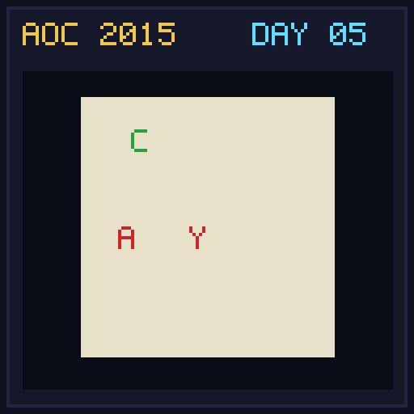
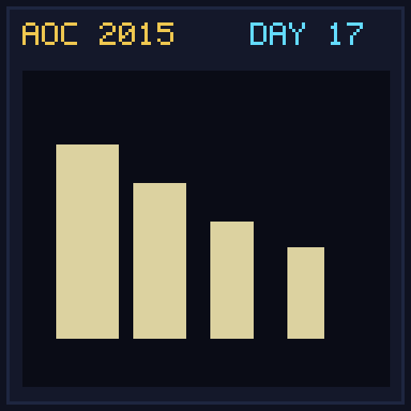

# Advent of Code 2015

Welcome to the solutions for Advent of Code 2015!
Here you can find the solutions, explanations, and art for each day.

## Solutions

| Day | Title | Part 1 | Part 2 | Total | Links |
|:---:|:---|:---:|:---:|:---:|:---|
| 01 | Not Quite Lisp | <1ms | <1ms | <1ms | [Readme](day01/README.md) / [Code](day01/Day01.kt) |
| 02 | I Was Told There Would Be No Math | 2.3ms | 1.0ms | 3.3ms | [Readme](day02/README.md) / [Code](day02/Day02.kt) |
| 03 | Perfectly Spherical Houses in a Vacuum | 1.0ms | 1.0ms | 2.0ms | [Readme](day03/README.md) / [Code](day03/Day03.kt) |
| 04 | The Ideal Stocking Stuffer | 176ms | 3479ms | 3655ms | [Readme](day04/README.md) / [Code](day04/Day04.kt) |
| 05 | Doesn't He Have Intern-Elves For This? | 2.0ms | 4.0ms | 6.0ms | [Readme](day05/README.md) / [Code](day05/Day05.kt) |
| 06 | Probably a Fire Hazard | 2936ms | 2308ms | 5245ms | [Readme](day06/README.md) / [Code](day06/Day06.kt) |
| 07 | Some Assembly Required | 6.0ms | 2.0ms | 8.0ms | [Readme](day07/README.md) / [Code](day07/Day07.kt) |
| 08 | Matchsticks | <1ms | <1ms | <1ms | [Readme](day08/README.md) / [Code](day08/Day08.kt) |
| 09 | All in a Single Night | 42ms | 23ms | 65ms | [Readme](day09/README.md) / [Code](day09/Day09.kt) |
| 10 | Elves Look, Elves Say | 15ms | 34ms | 49ms | [Readme](day10/README.md) / [Code](day10/Day10.kt) |
| 11 | Corporate Policy | 4.0ms | 74ms | 78ms | [Readme](day11/README.md) / [Code](day11/Day11.kt) |
| 12 | JSAbacusFramework.io | 3.0ms | 4.0ms | 7.0ms | [Readme](day12/README.md) / [Code](day12/Day12.kt) |
| 13 | Knights of the Dinner Table | N/A | N/A | N/A | [Readme](day13/README.md) / [Code](day13/Day13.kt) |
| 14 | Reindeer Olympics | N/A | N/A | N/A | [Readme](day14/README.md) / [Code](day14/Day14.kt) |
| 15 | Science for Hungry People | N/A | N/A | N/A | [Readme](day15/README.md) / [Code](day15/Day15.kt) |
| 16 | Aunt Sue | N/A | N/A | N/A | [Readme](day16/README.md) / [Code](day16/Day16.kt) |
| 17 | No Such Thing as Too Much | N/A | N/A | N/A | [Readme](day17/README.md) / [Code](day17/Day17.kt) |
| 18 | Like a GIF For Your Yard | N/A | N/A | N/A | [Readme](day18/README.md) / [Code](day18/Day18.kt) |
| 19 | Medicine for Rudolph | N/A | N/A | N/A | [Readme](day19/README.md) / [Code](day19/Day19.kt) |
| 20 | Infinite Elves and Infinite Houses | N/A | N/A | N/A | [Readme](day20/README.md) / [Code](day20/Day20.kt) |
| 21 | RPG Simulator 20XX | N/A | N/A | N/A | [Readme](day21/README.md) / [Code](day21/Day21.kt) |
| 22 | Wizard Simulator 20XX | N/A | N/A | N/A | [Readme](day22/README.md) / [Code](day22/Day22.kt) |
| 23 | Opening the Turing Lock | N/A | N/A | N/A | [Readme](day23/README.md) / [Code](day23/Day23.kt) |
| 24 | It Hangs in the Balance | N/A | N/A | N/A | [Readme](day24/README.md) / [Code](day24/Day24.kt) |
| 25 | Let It Snow | N/A | N/A | N/A | [Readme](day25/README.md) / [Code](day25/Day25.kt) |

## Gallery

  
  
  
  
  
  
  
  
  
  
  
  
  
  
  
  
  
  
  
  
  
  
  
  
  

