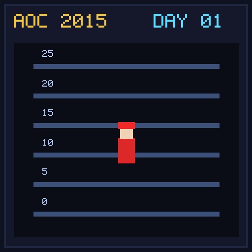

[< AoC 2015](../README.md) | [Day 02 >](../day02/README.md)

[View Problem on Advent of Code](https://adventofcode.com/2015/day/1)

## Setup

Santa is trying to deliver presents in a high-rise apartment building. He starts on ground floor (floor 0) and follows a sequence of parentheses instructions where `(` means go up one floor and `)` means go down one floor.

## Solution

### Part 1

Calculate Santa's final floor by taking the count of `(` minus the count of `)`. We process instructions using signed distances.

### Part 2

Determine the 1-based character index of the first instruction that causes Santa to enter the basement (floor -1).

## Performance

| Part | Runtime |
|:---:|:---:|
| Part 1 | 0.0ms |
| Part 2 | 0.0ms |
| **Total** | **0.0ms** |

