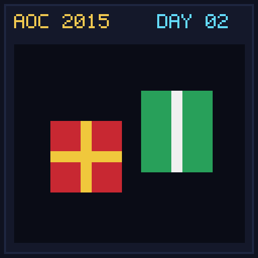

[< Day 01](../day01/README.md) | [AoC 2015](../README.md) | [Day 03 >](../day03/README.md)

[View Problem on Advent of Code](https://adventofcode.com/2015/day/2)

## Setup

The Elves need to order wrapping paper and ribbon for rectangular boxes with dimensions `l x w x h`.

## Solution

### Part 1

Wrapping paper required for each box is `2*l*w + 2*w*h + 2*h*l` plus the area of the smallest face as slack. Sum total paper over all presents.

### Part 2

Ribbon required is the smallest perimeter of any face plus the volume `l * w * h` for the bow. Sum total ribbon length over all presents.

## Performance

| Part | Runtime |
|:---:|:---:|
| Part 1 | 3ms |
| Part 2 | 1ms |
| **Total** | **4ms** |

