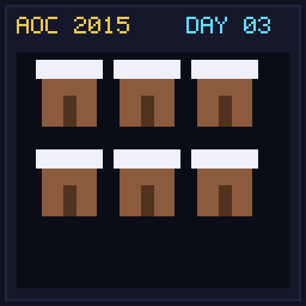

[< Day 02](../day02/README.md) | [AoC 2015](../README.md) | [Day 04 >](../day04/README.md)

[View Problem on Advent of Code](https://adventofcode.com/2015/day/3)

## Setup

Santa delivers presents to houses on a 2D infinite grid based on movement directions `^`, `v`, `<`, `>`.

## Solution

### Part 1

Track all visited grid coordinates `(x, y)` in a `Set` starting from `(0, 0)` and count unique houses visited.

### Part 2

Santa and Robo-Santa alternate taking movement instructions. Track visited coordinates from both actors in a shared `Set`.

## Performance

| Part | Runtime |
|:---:|:---:|
| Part 1 | 1.0ms |
| Part 2 | 1.0ms |
| **Total** | **2.0ms** |

