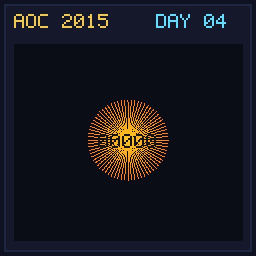

[< Day 03](../day03/README.md) | [AoC 2015](../README.md) | [Day 05 >](../day05/README.md)

[View Problem on Advent of Code](https://adventofcode.com/2015/day/4)

## Setup

Santa needs to mine AdventCoins by finding positive integers `n` such that the MD5 hash of `secret_key + n` starts with a required number of zeroes.

## Solution

### Part 1

Find the lowest positive integer `n` where MD5 hash starts with 5 hex zeroes (`00000`).

### Part 2

Find the lowest positive integer `n` where MD5 hash starts with 6 hex zeroes (`000000`).

## Performance

| Part | Runtime |
|:---:|:---:|
| Part 1 | 148ms |
| Part 2 | 3470ms |
| **Total** | **3617ms** |

