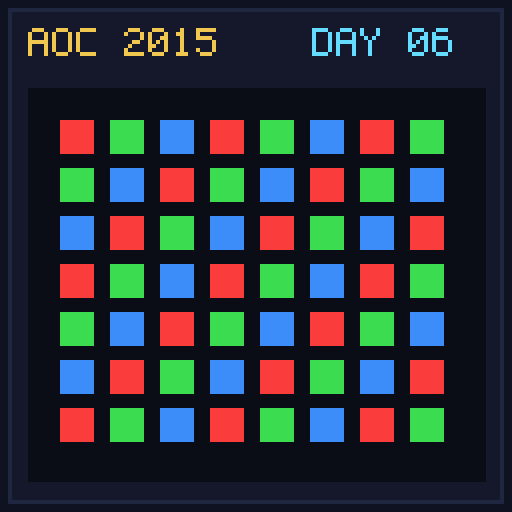

[< Day 05](../day05/README.md) | [AoC 2015](../README.md) | [Day 07 >](../day07/README.md)

[View Problem on Advent of Code](https://adventofcode.com/2015/day/6)

## Setup

Santa deploys a 1000x1000 grid of lights controlled by instructions `turn on`, `turn off`, or `toggle` over rectangle ranges.

## Solution

### Part 1

Model lights as booleans (on/off) and count total lit lights after processing instructions.

### Part 2

Model lights as integer brightness levels where `turn on` increases by 1, `turn off` decreases by 1 (min 0), and `toggle` increases by 2. Sum total brightness.

## Performance

| Part | Runtime |
|:---:|:---:|
| Part 1 | 2890ms |
| Part 2 | 2146ms |
| **Total** | **5036ms** |

