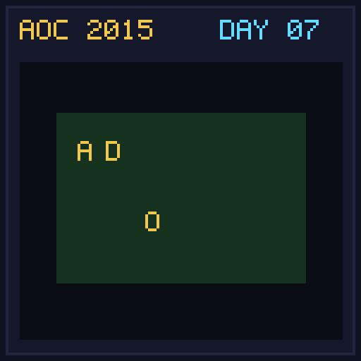

[< Day 06](../day06/README.md) | [AoC 2015](../README.md) | [Day 08 >](../day08/README.md)

[View Problem on Advent of Code](https://adventofcode.com/2015/day/7)

## Setup

Little Bobby received a bitwise logic circuit kit with 16-bit signals connected via gates `AND`, `OR`, `LSHIFT`, `RSHIFT`, and `NOT`.

## Solution

### Part 1

Recursively evaluate signal values on wires using memoization to handle dependency graphs and compute the value of wire `a`.

### Part 2

Override wire `b` with the output value of wire `a` from Part 1, reset signal cache, and recompute wire `a`.

## Performance

| Part | Runtime |
|:---:|:---:|
| Part 1 | 6.7ms |
| Part 2 | 2.0ms |
| **Total** | **8.7ms** |

