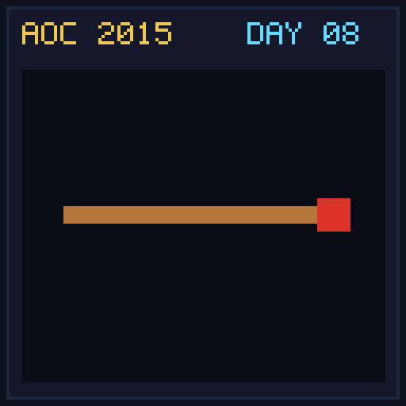

[< Day 07](../day07/README.md) | [AoC 2015](../README.md) | [Day 09 >](../day09/README.md)

[View Problem on Advent of Code](https://adventofcode.com/2015/day/8)

## Setup

Santa needs to calculate digital string memory overhead for code representations of string literals containing escape sequences (`\\`, `\"`, `\xHEX`).

## Solution

### Part 1

Calculate `total_code_characters - total_in_memory_characters` across all input lines.

### Part 2

Encode each string by escaping backslashes and double quotes, and calculate `total_encoded_characters - total_code_characters`.

## Performance

| Part | Runtime |
|:---:|:---:|
| Part 1 | 0.0ms |
| Part 2 | 0.0ms |
| **Total** | **0.0ms** |

