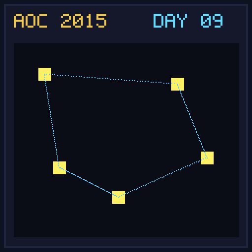

[< Day 08](../day08/README.md) | [AoC 2015](../README.md) | [Day 10 >](../day10/README.md)

[View Problem on Advent of Code](https://adventofcode.com/2015/day/9)

## Setup

Santa needs to visit a list of locations with given pairwise distances in a single night.

## Solution

### Part 1

Find the shortest route visiting every location exactly once by generating all location permutations and calculating path lengths.

### Part 2

Find the longest route visiting every location exactly once.

## Performance

| Part | Runtime |
|:---:|:---:|
| Part 1 | 42ms |
| Part 2 | 23ms |
| **Total** | **65ms** |

