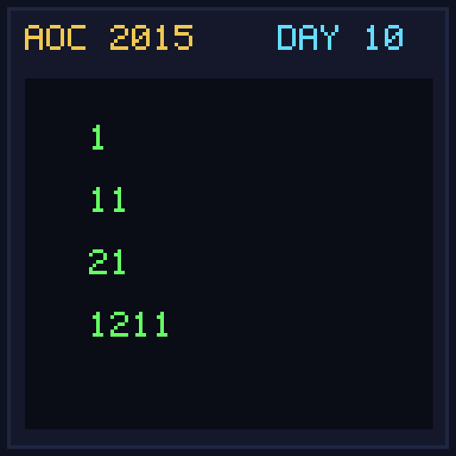

[< Day 09](../day09/README.md) | [AoC 2015](../README.md) | [Day 11 >](../day11/README.md)

[View Problem on Advent of Code](https://adventofcode.com/2015/day/10)

## Setup

The Elves play a look-and-say sequence game where digits are replaced by their run-length encoding (e.g. `1` -> `11`, `11` -> `21`, `21` -> `1211`).

## Solution

### Part 1

Apply the look-and-say process 40 times starting from the puzzle input string and return the length of the resulting string.

### Part 2

Apply the look-and-say process 50 times and return the length.

## Performance

| Part | Runtime |
|:---:|:---:|
| Part 1 | 15ms |
| Part 2 | 34ms |
| **Total** | **49ms** |

