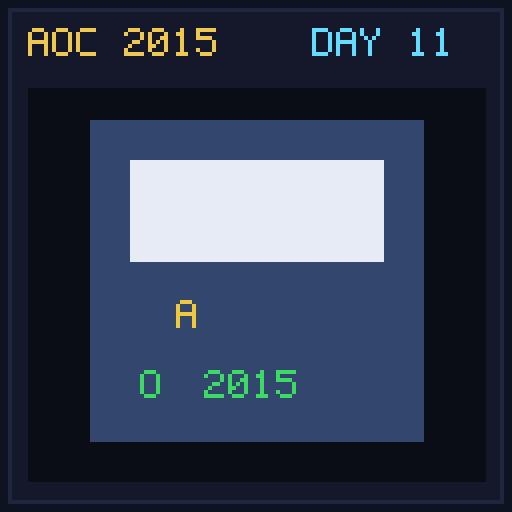

[< Day 10](../day10/README.md) | [AoC 2015](../README.md) | [Day 12 >](../day12/README.md)

[View Problem on Advent of Code](https://adventofcode.com/2015/day/11)

## Setup

Santa's password expires and needs to be incremented to the next valid password using base-26 lowercase alphabet incrementing.

## Solution

### Part 1

Find the next valid password after puzzle input that contains a 3-letter straight (`abc`, `bcd`), no `i`, `o`, `l`, and at least two non-overlapping letter pairs (`aa` and `bb`).

### Part 2

Find the next valid password following the result of Part 1.

## Performance

| Part | Runtime |
|:---:|:---:|
| Part 1 | 4ms |
| Part 2 | 77ms |
| **Total** | **81ms** |

