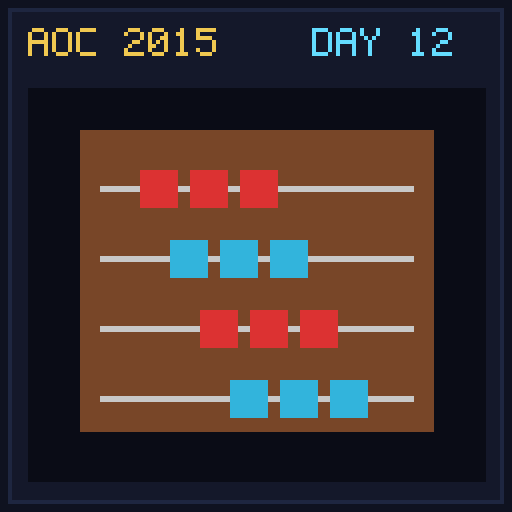

[< Day 11](../day11/README.md) | [AoC 2015](../README.md) | [Day 13 >](../day13/README.md)

[View Problem on Advent of Code](https://adventofcode.com/2015/day/12)

## Setup

Santa's accounting system stores financial records in a JSON document.

## Solution

### Part 1

Extract all numbers from the JSON document using regular expressions or JSON parsing and sum them together.

### Part 2

Parse the JSON structure recursively and sum all numbers, ignoring any JSON object (and its children) that contains a property with the value `"red"`.

## Performance

| Part | Runtime |
|:---:|:---:|
| Part 1 | 3.0ms |
| Part 2 | 4.0ms |
| **Total** | **7.0ms** |

