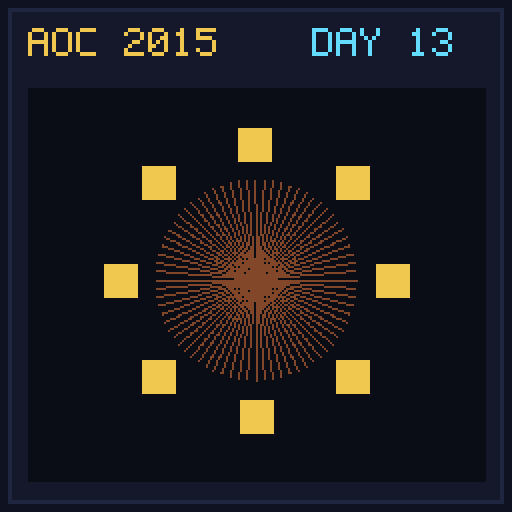

[< Day 12](../day12/README.md) | [AoC 2015](../README.md) | [Day 14 >](../day14/README.md)

[View Problem on Advent of Code](https://adventofcode.com/2015/day/13)

## Setup

Optimize circular table seating arrangements for holiday guests based on gain/loss of happiness scores when seated next to each other.

## Solution

### Part 1

Generate all circular permutations of guests and find the maximum total happiness score.

### Part 2

Add yourself (with 0 happiness change for all neighbors) to the guest list and find the new maximum happiness.

## Performance

| Part | Runtime |
|:---:|:---:|
| Part 1 | N/A |
| Part 2 | N/A |
| **Total** | **0.0ms** |

