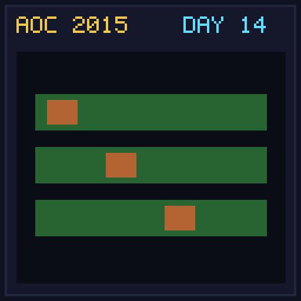

[< Day 13](../day13/README.md) | [AoC 2015](../README.md) | [Day 15 >](../day15/README.md)

[View Problem on Advent of Code](https://adventofcode.com/2015/day/14)

## Setup

Reindeer compete in a race where each reindeer flies at a constant speed for a duration, then rests for a duration in repeating cycles.

## Solution

### Part 1

Simulate reindeer distance after 2503 seconds and find the maximum distance traveled.

### Part 2

Simulate the race second-by-second, awarding 1 point per second to whichever reindeer is currently in the lead, and find the maximum points.

## Performance

| Part | Runtime |
|:---:|:---:|
| Part 1 | N/A |
| Part 2 | N/A |
| **Total** | **N/A** |

