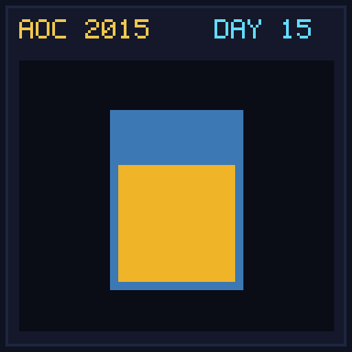

[< Day 14](../day14/README.md) | [AoC 2015](../README.md) | [Day 16 >](../day16/README.md)

[View Problem on Advent of Code](https://adventofcode.com/2015/day/15)

## Setup

Create the perfect cookie recipe by finding the optimal combination of 100 total teaspoons of ingredients with capacity, durability, flavor, texture, and calorie properties.

## Solution

### Part 1

Find the ingredient ratio combination that maximizes total score (`max(0, capacity) * max(0, durability) * max(0, flavor) * max(0, texture)`).

### Part 2

Find the maximum total score among ingredient ratios that yield exactly 500 calories.

## Performance

| Part | Runtime |
|:---:|:---:|
| Part 1 | N/A |
| Part 2 | N/A |
| **Total** | **0.0ms** |

