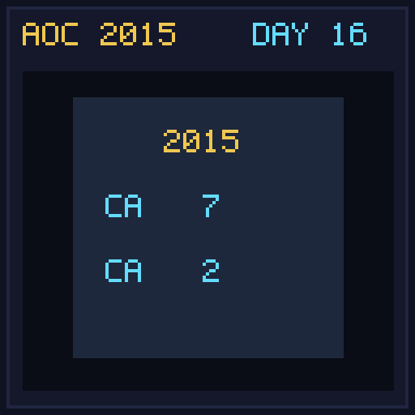

[< Day 15](../day15/README.md) | [AoC 2015](../README.md) | [Day 17 >](../day17/README.md)

[View Problem on Advent of Code](https://adventofcode.com/2015/day/16)

## Setup

Determine which of 500 Aunt Sues sent a thank-you gift based on incomplete memory properties analyzed by the MFCSAM machine.

## Solution

### Part 1

Find Aunt Sue whose listed attributes exactly match the target MFCSAM output.

### Part 2

Update matching rules so `cats` and `trees` are greater than target values, and `pomeranians` and `goldfish` are less than target values.

## Performance

| Part | Runtime |
|:---:|:---:|
| Part 1 | N/A |
| Part 2 | N/A |
| **Total** | **N/A** |

