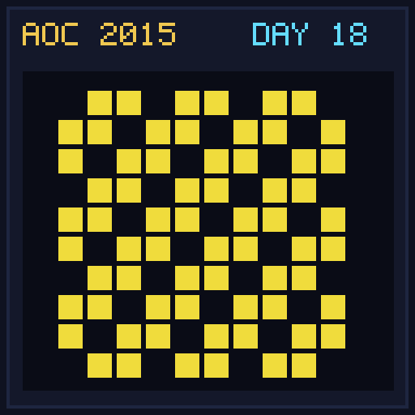

[< Day 17](../day17/README.md) | [AoC 2015](../README.md) | [Day 19 >](../day19/README.md)

[View Problem on Advent of Code](https://adventofcode.com/2015/day/18)

## Setup

A 100x100 grid of Christmas light bulbs toggles state every step based on 2D Game of Life rules.

## Solution

### Part 1

Simulate 100 animation steps and count total lights turned on.

### Part 2

Simulate 100 animation steps with the 4 corner lights permanently stuck in the 'ON' state.

## Performance

| Part | Runtime |
|:---:|:---:|
| Part 1 | N/A |
| Part 2 | N/A |
| **Total** | **N/A** |

