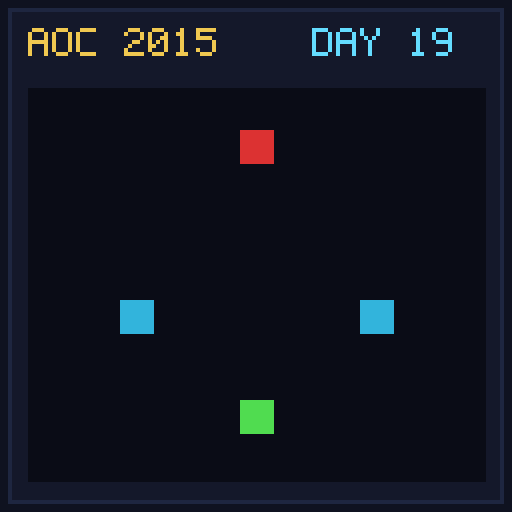

[< Day 18](../day18/README.md) | [AoC 2015](../README.md) | [Day 20 >](../day20/README.md)

[View Problem on Advent of Code](https://adventofcode.com/2015/day/19)

## Setup

Rudolph gets sick and requires medicine fabricated by applying replacement rules to a starting molecule string.

## Solution

### Part 1

Apply each single replacement rule to the starting molecule and count the number of unique resulting molecules.

### Part 2

Determine the minimum number of replacement steps to synthesize the target molecule starting from single element `e` using greedy/AST reduction.

## Performance

| Part | Runtime |
|:---:|:---:|
| Part 1 | N/A |
| Part 2 | N/A |
| **Total** | **N/A** |

