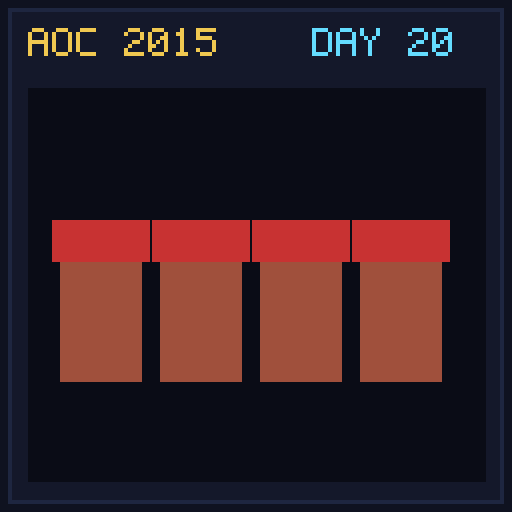

[< Day 19](../day19/README.md) | [AoC 2015](../README.md) | [Day 21 >](../day21/README.md)

[View Problem on Advent of Code](https://adventofcode.com/2015/day/20)

## Setup

Infinite elves deliver presents to infinite numbered houses where Elf `N` delivers presents to houses that are multiples of `N`.

## Solution

### Part 1

Find the lowest house number that receives at least 29,000,000 presents when Elf `N` delivers `10*N` presents to all multiples.

### Part 2

Find the lowest house number when each elf stops delivering after 50 houses and delivers `11*N` presents per house.

## Performance

| Part | Runtime |
|:---:|:---:|
| Part 1 | N/A |
| Part 2 | N/A |
| **Total** | **0.0ms** |

