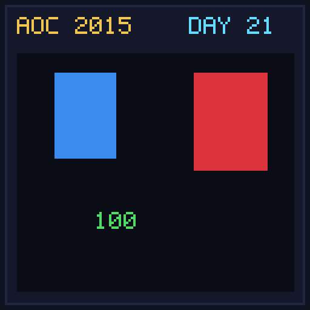

[< Day 20](../day20/README.md) | [AoC 2015](../README.md) | [Day 22 >](../day22/README.md)

[View Problem on Advent of Code](https://adventofcode.com/2015/day/21)

## Setup

Turn-based RPG battle against a Boss monster where the player buys weapons, armor, and rings from an item shop.

## Solution

### Part 1

Find the minimum gold spent on equipment that guarantees a player victory against the Boss.

### Part 2

Find the maximum gold spent on equipment that still results in a player loss.

## Performance

| Part | Runtime |
|:---:|:---:|
| Part 1 | N/A |
| Part 2 | N/A |
| **Total** | **N/A** |

