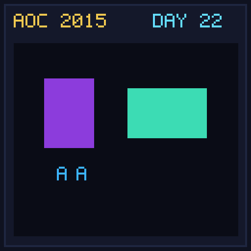

[< Day 21](../day21/README.md) | [AoC 2015](../README.md) | [Day 23 >](../day23/README.md)

[View Problem on Advent of Code](https://adventofcode.com/2015/day/22)

## Setup

Turn-based magic duel against a Boss where the player casts spells using Mana (Magic Missile, Drain, Shield, Poison, Recharge).

## Solution

### Part 1

Find the minimum total mana spent to defeat the Boss in Normal mode using state-space search (BFS/Dijkstra).

### Part 2

Find the minimum total mana spent to defeat the Boss in Hard mode (where player loses 1 HP at start of every player turn).

## Performance

| Part | Runtime |
|:---:|:---:|
| Part 1 | N/A |
| Part 2 | N/A |
| **Total** | **N/A** |

