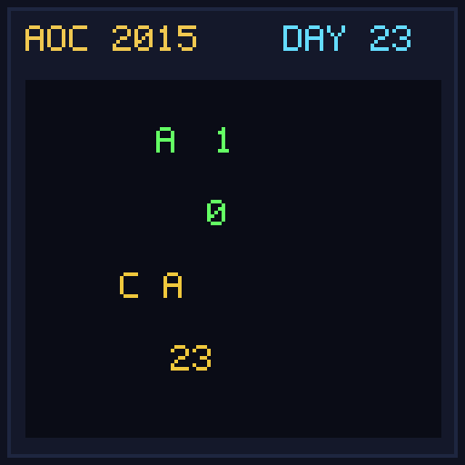

[< Day 22](../day22/README.md) | [AoC 2015](../README.md) | [Day 24 >](../day24/README.md)

[View Problem on Advent of Code](https://adventofcode.com/2015/day/23)

## Setup

A virtual machine with registers `a` and `b` executes assembly instructions `hlf`, `tpl`, `inc`, `jmp`, `jie`, and `jio`.

## Solution

### Part 1

Execute instructions starting with `a = 0, b = 0` until program terminates and return the value of register `b`.

### Part 2

Execute instructions starting with `a = 1, b = 0` and return the final value of register `b`.

## Performance

| Part | Runtime |
|:---:|:---:|
| Part 1 | N/A |
| Part 2 | N/A |
| **Total** | **0.0ms** |

