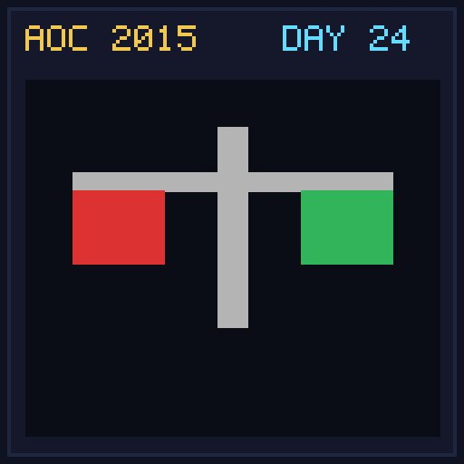

[< Day 23](../day23/README.md) | [AoC 2015](../README.md) | [Day 25 >](../day25/README.md)

[View Problem on Advent of Code](https://adventofcode.com/2015/day/24)

## Setup

Balance Santa's sleigh by partitioning package weights into equal-weight groups.

## Solution

### Part 1

Partition packages into 3 equal-weight groups, minimizing the number of packages in the passenger compartment and choosing the smallest Quantum Entanglement (product of package weights).

### Part 2

Partition packages into 4 equal-weight groups with the same selection criteria.

## Performance

| Part | Runtime |
|:---:|:---:|
| Part 1 | N/A |
| Part 2 | N/A |
| **Total** | **N/A** |

