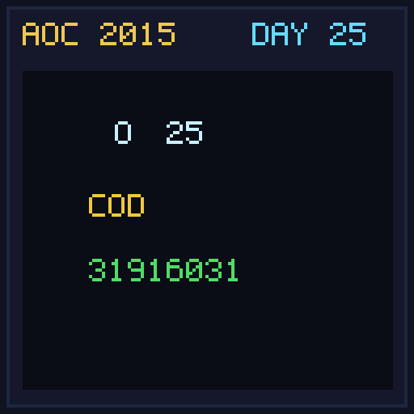

[< Day 24](../day24/README.md) | [AoC 2015](../README.md)

[View Problem on Advent of Code](https://adventofcode.com/2015/day/25)

## Setup

The weather machine requires a code generated by a modular exponentiation grid sequence (`code = (prev * 252533) % 33554393`).

## Solution

### Part 1

Calculate the diagonal sequence index for target coordinate `(row 2978, column 3083)` and compute the modular code.

### Part 2

Start the weather machine and fill the sky with snow!

## Performance

| Part | Runtime |
|:---:|:---:|
| Part 1 | N/A |
| Part 2 | N/A |
| **Total** | **N/A** |

