# Advent of Code 2016

Welcome to the solutions for Advent of Code 2016!
Here you can find the solutions, explanations, and art for each day.

## Solutions

| Day | Title | Part 1 | Part 2 | Total | Links |
|:---:|:---|:---:|:---:|:---:|:---|
| 01 | No Time for a Taxicab | 1.0ms | <1ms | 1.0ms | [Readme](day01/README.md) / [Code](day01/Day01.kt) |
| 02 | Bathroom Security | <1ms | <1ms | <1ms | [Readme](day02/README.md) / [Code](day02/Day02.kt) |
| 03 | Squares With Three Sides | 6.0ms | 8.0ms | 14ms | [Readme](day03/README.md) / [Code](day03/Day03.kt) |
| 04 | Security Through Obscurity | 10ms | 5.0ms | 15ms | [Readme](day04/README.md) / [Code](day04/Day04.kt) |
| 05 | How About a Nice Game of Chess? | 745ms | 2193ms | 2938ms | [Readme](day05/README.md) / [Code](day05/Day05.kt) |
| 06 | Signals and Noise | 1.0ms | 1.0ms | 2.0ms | [Readme](day06/README.md) / [Code](day06/Day06.kt) |
| 07 | Internet Protocol Version 7 | 10ms | 11ms | 21ms | [Readme](day07/README.md) / [Code](day07/Day07.kt) |
| 08 | Two-Factor Authentication | 17ms | 3.0ms | 20ms | [Readme](day08/README.md) / [Code](day08/Day08.kt) |
| 09 | Explosives in Cyberspace | 3.0ms | 2.0ms | 5.0ms | [Readme](day09/README.md) / [Code](day09/Day09.kt) |
| 10 | Balance Bots | 3.0ms | 1.0ms | 4.0ms | [Readme](day10/README.md) / [Code](day10/Day10.kt) |
| 11 | Radioisotope Thermoelectric Generators | 109ms | 294ms | 403ms | [Readme](day11/README.md) / [Code](day11/Day11.kt) |
| 12 | Leonardo's Monorail | 7.0ms | 68ms | 75ms | [Readme](day12/README.md) / [Code](day12/Day12.kt) |
| 13 | A Maze of Twisty Little Cubicles | 2.0ms | 1.0ms | 3.0ms | [Readme](day13/README.md) / [Code](day13/Day13.kt) |
| 14 | One-Time Pad | 3177ms | 11150ms | 14327ms | [Readme](day14/README.md) / [Code](day14/Day14.kt) |
| 15 | Timing is Everything | 2.0ms | 7.0ms | 9.0ms | [Readme](day15/README.md) / [Code](day15/Day15.kt) |
| 16 | Dragon Checksum | <1ms | 666ms | 666ms | [Readme](day16/README.md) / [Code](day16/Day16.kt) |
| 17 | Two Steps Forward | 1.0ms | 54ms | 55ms | [Readme](day17/README.md) / [Code](day17/Day17.kt) |
| 18 | Like a Rogue | N/A | N/A | N/A | [Readme](day18/README.md) / [Code](day18/Day18.kt) |
| 19 | An Elephant Named Joseph | N/A | N/A | N/A | [Readme](day19/README.md) / [Code](day19/Day19.kt) |
| 20 | Firewall Rules | N/A | N/A | N/A | [Readme](day20/README.md) / [Code](day20/Day20.kt) |
| 21 | Scrambled Letters and Hash | N/A | N/A | N/A | [Readme](day21/README.md) / [Code](day21/Day21.kt) |
| 22 | Grid Computing | N/A | N/A | N/A | [Readme](day22/README.md) / [Code](day22/Day22.kt) |
| 23 | Safe Cracking | 15ms | 9009ms | 9024ms | [Readme](day23/README.md) / [Code](day23/Day23.kt) |
| 24 | Air Duct Spelunking | 28ms | 8.0ms | 36ms | [Readme](day24/README.md) / [Code](day24/Day24.kt) |
| 25 | Clock Signal | 82ms | N/A | 82ms | [Readme](day25/README.md) / [Code](day25/Day25.kt) |

## Gallery

  
  <a href="day02/README.md">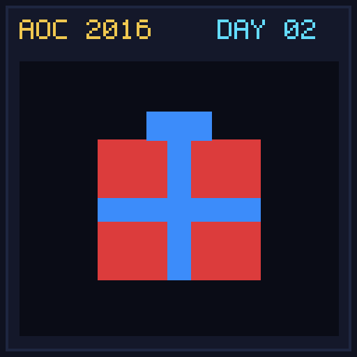</a>
  
  
  <a href="day05/README.md">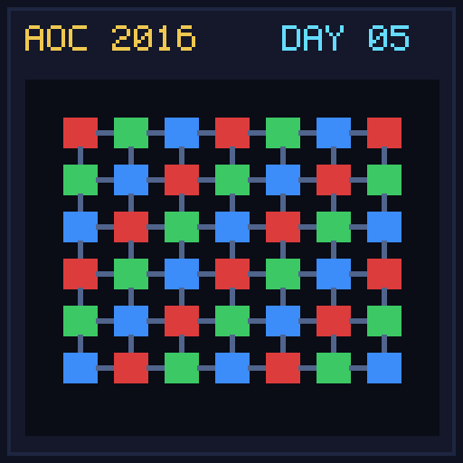</a>
  <a href="day06/README.md">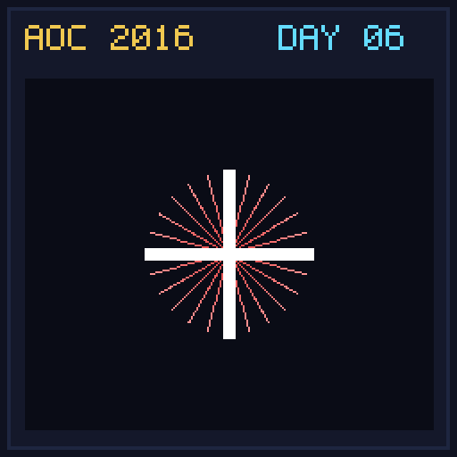</a>
  <a href="day07/README.md">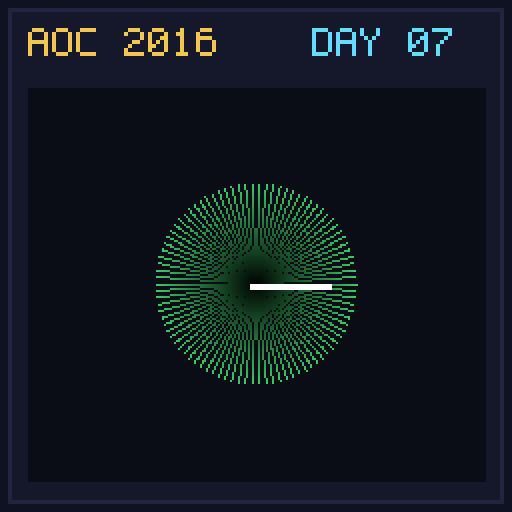</a>
  
  <a href="day09/README.md">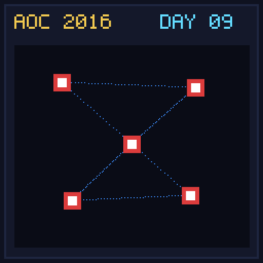</a>
  
  
  <a href="day12/README.md">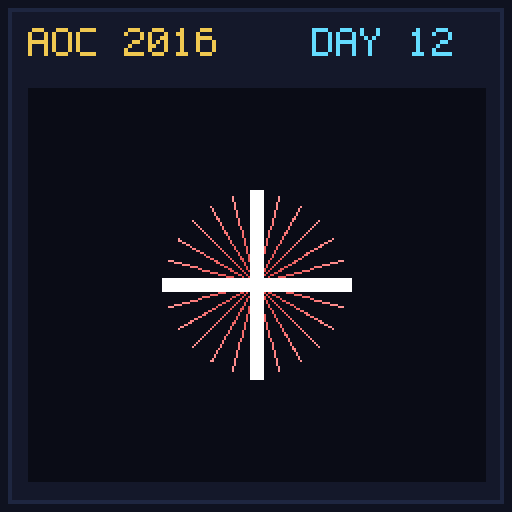</a>
  
  <a href="day14/README.md">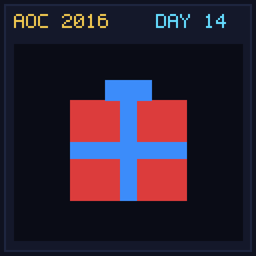</a>
  <a href="day15/README.md">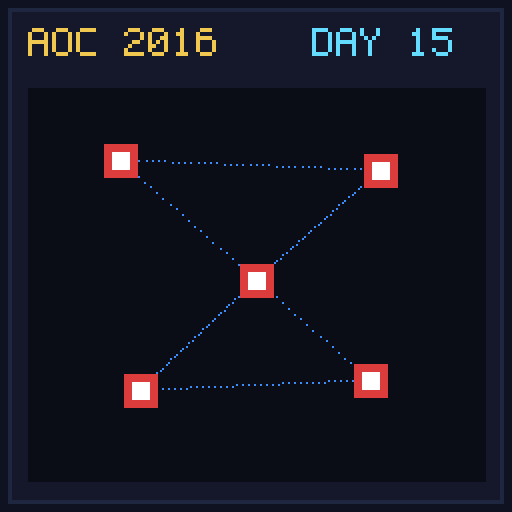</a>
  <a href="day16/README.md">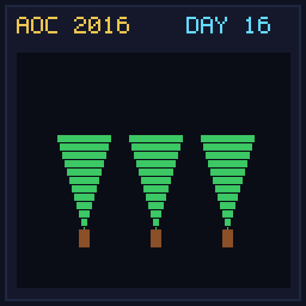</a>
  <a href="day17/README.md">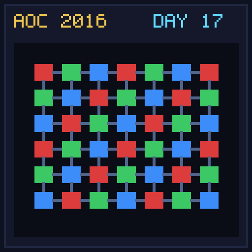</a>
  <a href="day18/README.md">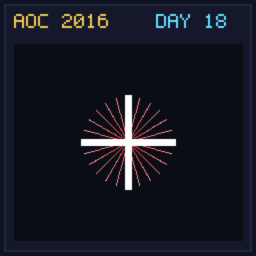</a>
  <a href="day19/README.md">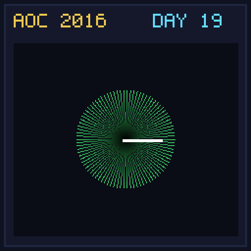</a>
  
  <a href="day21/README.md">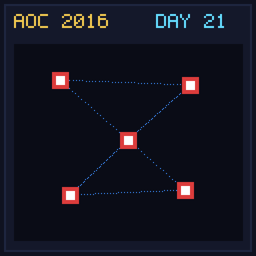</a>
  <a href="day22/README.md">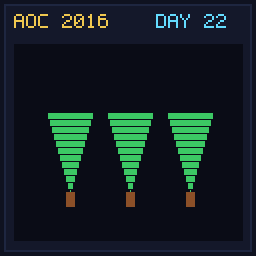</a>
  
  <a href="day24/README.md">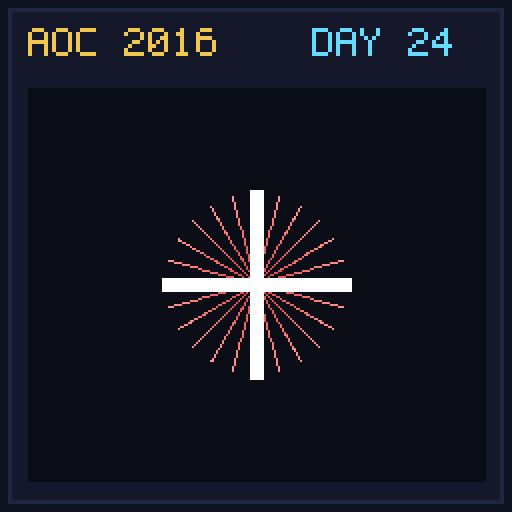</a>
  

