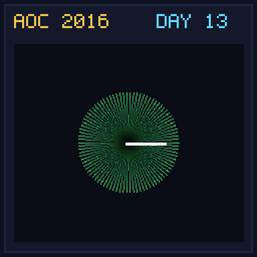

[< Day 12](../day12/README.md) | [AoC 2016](../README.md) | [Day 14 >](../day14/README.md)

[View Problem on Advent of Code](https://adventofcode.com/2016/day/13)

## Setup

A Maze of Twisty Little Cubicles - Day 13 of Advent of Code 2016.

## Solution

### Part 1

Solve Part 1 of the puzzle using idiomatic Kotlin.

### Part 2

Solve Part 2 of the puzzle.

## Performance

| Part | Runtime |
|:---:|:---:|
| Part 1 | 2.0ms |
| Part 2 | 1.0ms |
| **Total** | **3.0ms** |

