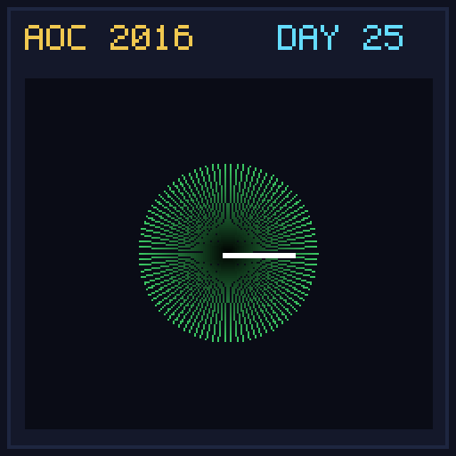

[< Day 24](../day24/README.md) | [AoC 2016](../README.md)

[View Problem on Advent of Code](https://adventofcode.com/2016/day/25)

## Setup

Clock Signal - Day 25 of Advent of Code 2016.

## Solution

### Part 1

Solve Part 1 of the puzzle using idiomatic Kotlin.

### Part 2

Solve Part 2 of the puzzle.

## Performance

| Part | Runtime |
|:---:|:---:|
| Part 1 | 82ms |
| Part 2 | N/A |
| **Total** | **82ms** |

