# Advent of Code 2018

Welcome to the solutions for Advent of Code 2018!
Here you can find the solutions, explanations, and art for each day.

## Solutions

| Day | Title | Part 1 | Part 2 | Total | Links |
|:---:|:---|:---:|:---:|:---:|:---|
| 01 | Chronal Calibration | <1ms | 6.0ms | 6.0ms | [Readme](day01/README.md) / [Code](day01/Day01.kt) |
| 02 | Inventory Management System | 8.0ms | 15ms | 23ms | [Readme](day02/README.md) / [Code](day02/Day02.kt) |
| 03 | No Matter How You Slice It | 176ms | 65ms | 241ms | [Readme](day03/README.md) / [Code](day03/Day03.kt) |
| 04 | Repose Record | 51ms | 9.0ms | 60ms | [Readme](day04/README.md) / [Code](day04/Day04.kt) |
| 05 | Alchemical Reduction | 32ms | 570ms | 602ms | [Readme](day05/README.md) / [Code](day05/Day05.kt) |
| 06 | Chronal Coordinates | 151ms | 20ms | 171ms | [Readme](day06/README.md) / [Code](day06/Day06.kt) |
| 07 | The Sum of Its Parts | 10ms | 1.0ms | 11ms | [Readme](day07/README.md) / [Code](day07/Day07.kt) |
| 08 | Memory Maneuver | 7.0ms | 2.0ms | 9.0ms | [Readme](day08/README.md) / [Code](day08/Day08.kt) |
| 09 | Marble Mania | 13ms | 71ms | 84ms | [Readme](day09/README.md) / [Code](day09/Day09.kt) |
| 10 | The Stars Align | 101ms | <1ms | 101ms | [Readme](day10/README.md) / [Code](day10/Day10.kt) |
| 11 | Chronal Charge | 36ms | 8267ms | 8303ms | [Readme](day11/README.md) / [Code](day11/Day11.kt) |
| 12 | Subterranean Sustainability | 13ms | <1ms | 13ms | [Readme](day12/README.md) / [Code](day12/Day12.kt) |
| 13 | Mine Cart Madness | 25ms | 24ms | 49ms | [Readme](day13/README.md) / [Code](day13/Day13.kt) |
| 14 | Chocolate Charts | 17ms | 2084ms | 2101ms | [Readme](day14/README.md) / [Code](day14/Day14.kt) |
| 15 | Beverage Bandits | 71ms | 123ms | 194ms | [Readme](day15/README.md) / [Code](day15/Day15.kt) |
| 16 | Chronal Classification | N/A | N/A | N/A | [Readme](day16/README.md) / [Code](day16/Day16.kt) |
| 17 | Reservoir Research | N/A | N/A | N/A | [Readme](day17/README.md) / [Code](day17/Day17.kt) |
| 18 | Settlers of The North Pole | N/A | N/A | N/A | [Readme](day18/README.md) / [Code](day18/Day18.kt) |
| 19 | Go With The Flow | N/A | N/A | N/A | [Readme](day19/README.md) / [Code](day19/Day19.kt) |
| 20 | A Regular Map | N/A | N/A | N/A | [Readme](day20/README.md) / [Code](day20/Day20.kt) |
| 21 | Chronal Conversion | N/A | N/A | N/A | [Readme](day21/README.md) / [Code](day21/Day21.kt) |
| 22 | Mode Maze | N/A | N/A | N/A | [Readme](day22/README.md) / [Code](day22/Day22.kt) |
| 23 | Experimental Emergency Teleportation | N/A | N/A | N/A | [Readme](day23/README.md) / [Code](day23/Day23.kt) |
| 24 | Immune System Simulator 20XX | N/A | N/A | N/A | [Readme](day24/README.md) / [Code](day24/Day24.kt) |
| 25 | Four-Dimensional Adventure | N/A | N/A | N/A | [Readme](day25/README.md) / [Code](day25/Day25.kt) |

## Gallery

  
  
  
  
  
  <a href="day06/README.md">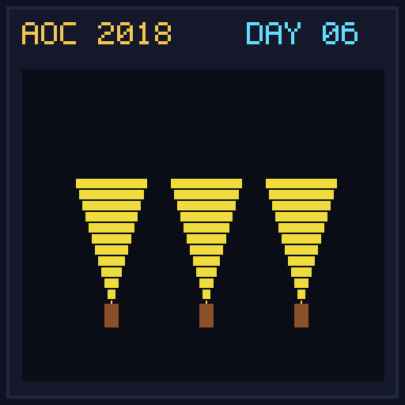</a>
  <a href="day07/README.md">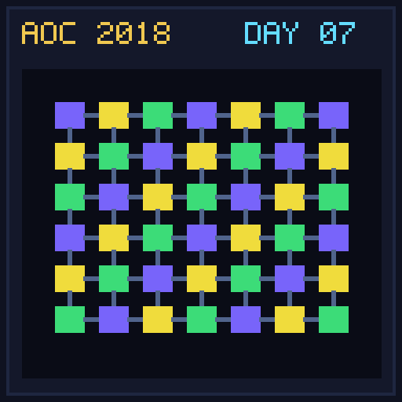</a>
  
  <a href="day09/README.md">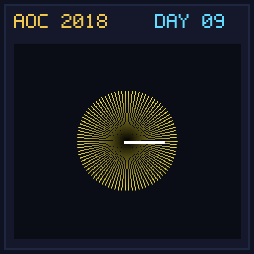</a>
  <a href="day10/README.md">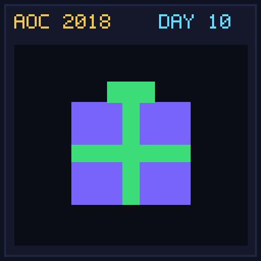</a>
  
  
  
  <a href="day14/README.md">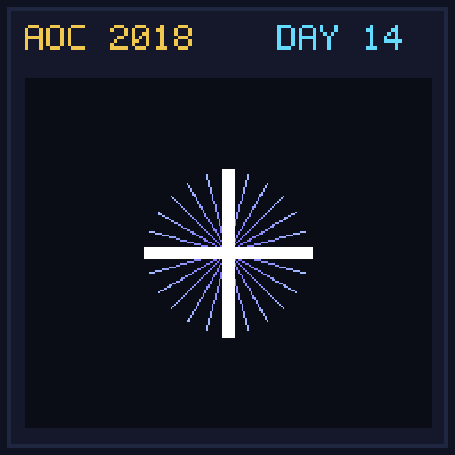</a>
  <a href="day15/README.md">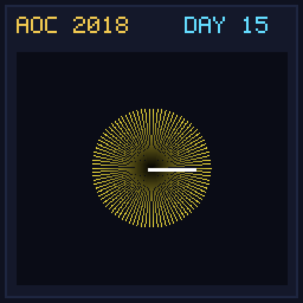</a>
  <a href="day16/README.md">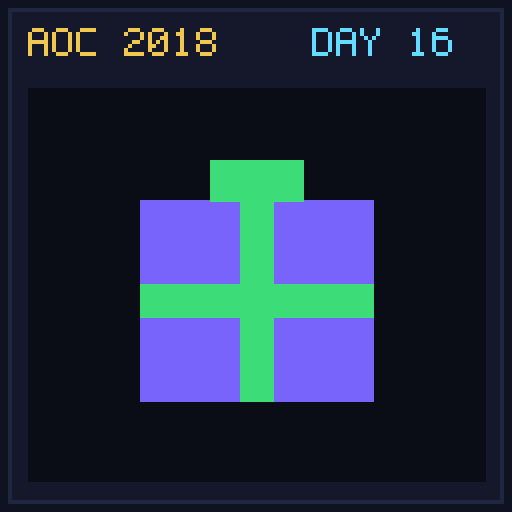</a>
  <a href="day17/README.md">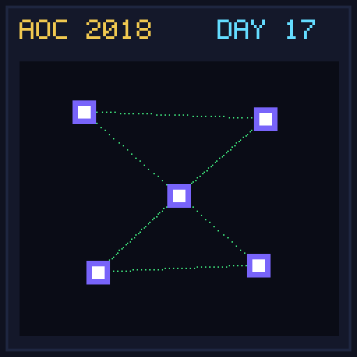</a>
  
  
  <a href="day20/README.md">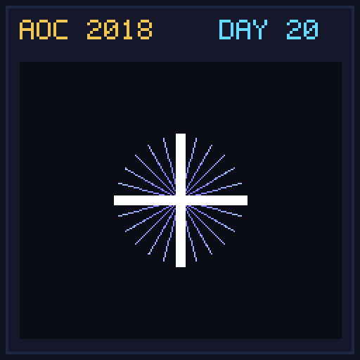</a>
  
  
  <a href="day23/README.md">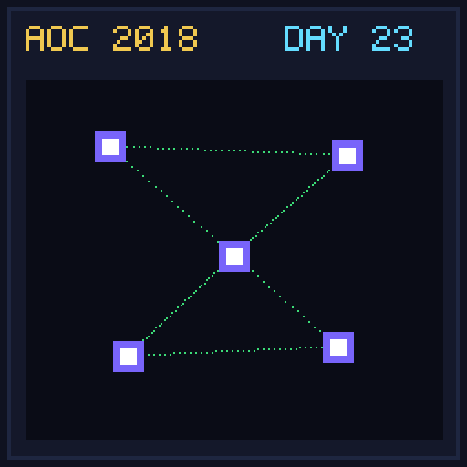</a>
  <a href="day24/README.md">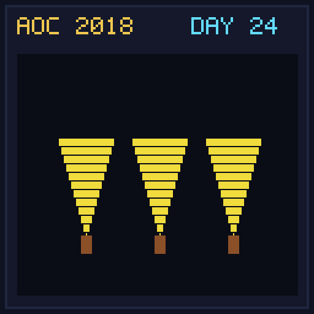</a>
  <a href="day25/README.md">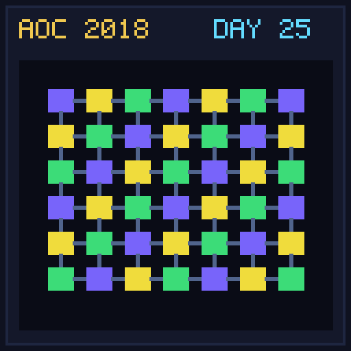</a>

