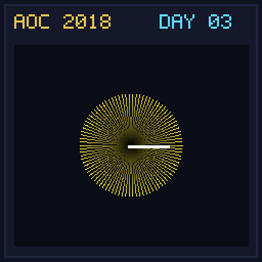

[< Day 02](../day02/README.md) | [AoC 2018](../README.md) | [Day 04 >](../day04/README.md)

[View Problem on Advent of Code](https://adventofcode.com/2018/day/3)

## Setup

No Matter How You Slice It - Day 3 of Advent of Code 2018.

## Solution

### Part 1

Solve Part 1 of the puzzle using idiomatic Kotlin.

### Part 2

Solve Part 2 of the puzzle.

## Performance

| Part | Runtime |
|:---:|:---:|
| Part 1 | 176ms |
| Part 2 | 65ms |
| **Total** | **241ms** |

