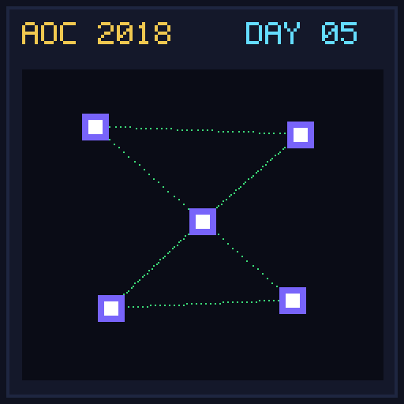

[< Day 04](../day04/README.md) | [AoC 2018](../README.md) | [Day 06 >](../day06/README.md)

[View Problem on Advent of Code](https://adventofcode.com/2018/day/5)

## Setup

Alchemical Reduction - Day 5 of Advent of Code 2018.

## Solution

### Part 1

Solve Part 1 of the puzzle using idiomatic Kotlin.

### Part 2

Solve Part 2 of the puzzle.

## Performance

| Part | Runtime |
|:---:|:---:|
| Part 1 | 32ms |
| Part 2 | 570ms |
| **Total** | **602ms** |

