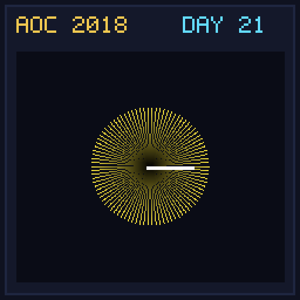

[< Day 20](../day20/README.md) | [AoC 2018](../README.md) | [Day 22 >](../day22/README.md)

[View Problem on Advent of Code](https://adventofcode.com/2018/day/21)

## Setup

Chronal Conversion - Day 21 of Advent of Code 2018.

## Solution

### Part 1

Solve Part 1 of the puzzle using idiomatic Kotlin.

### Part 2

Solve Part 2 of the puzzle.

## Performance

| Part | Runtime |
|:---:|:---:|
| Part 1 | N/A |
| Part 2 | N/A |
| **Total** | **N/A** |

