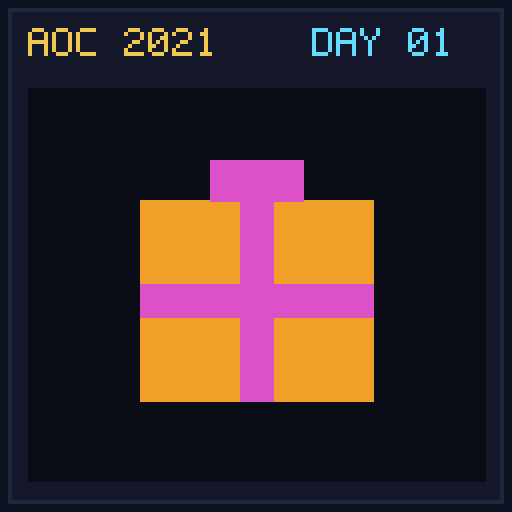

[< AoC 2021](../README.md) | [Day 02 >](../day02/README.md)

[View Problem on Advent of Code](https://adventofcode.com/2021/day/1)

## Setup

Sonar Sweep - Day 1 of Advent of Code 2021.

## Solution

### Part 1

Solve Part 1 of the puzzle using idiomatic Kotlin.

### Part 2

Solve Part 2 of the puzzle.

## Performance

| Part | Runtime |
|:---:|:---:|
| Part 1 | 27ms |
| Part 2 | N/A |
| **Total** | **27ms** |

