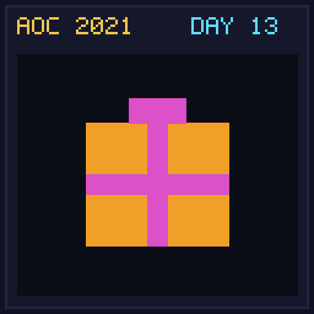

[< Day 12](../day12/README.md) | [AoC 2021](../README.md) | [Day 14 >](../day14/README.md)

[View Problem on Advent of Code](https://adventofcode.com/2021/day/13)

## Setup

Transparent Origami - Day 13 of Advent of Code 2021.

## Solution

### Part 1

Solve Part 1 of the puzzle using idiomatic Kotlin.

### Part 2

Solve Part 2 of the puzzle.

## Performance

| Part | Runtime |
|:---:|:---:|
| Part 1 | 131ms |
| Part 2 | N/A |
| **Total** | **131ms** |

