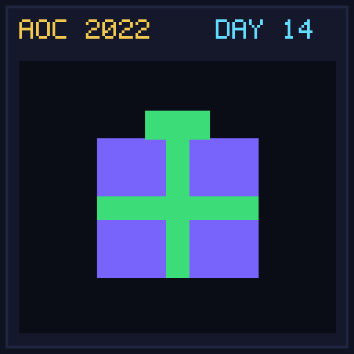

[< Day 13](../day13/README.md) | [AoC 2022](../README.md) | [Day 15 >](../day15/README.md)

[View Problem on Advent of Code](https://adventofcode.com/2022/day/14)

## Setup

Regolith Reservoir - Day 14 of Advent of Code 2022.

## Solution

### Part 1

Solve Part 1 of the puzzle using idiomatic Kotlin.

### Part 2

Solve Part 2 of the puzzle.

## Performance

| Part | Runtime |
|:---:|:---:|
| Part 1 | 17ms |
| Part 2 | 78ms |
| **Total** | **95ms** |

