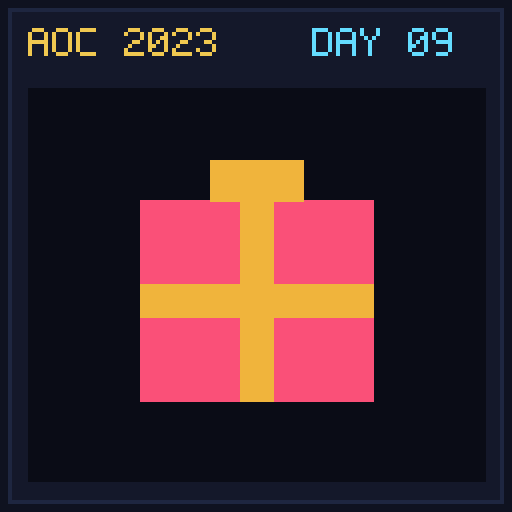

[< Day 08](../day08/README.md) | [AoC 2023](../README.md) | [Day 10 >](../day10/README.md)

[View Problem on Advent of Code](https://adventofcode.com/2023/day/9)

## Setup

Mirage Maintenance - Day 9 of Advent of Code 2023.

## Solution

### Part 1

Solve Part 1 of the puzzle using idiomatic Kotlin.

### Part 2

Solve Part 2 of the puzzle.

## Performance

| Part | Runtime |
|:---:|:---:|
| Part 1 | N/A |
| Part 2 | N/A |
| **Total** | **N/A** |

