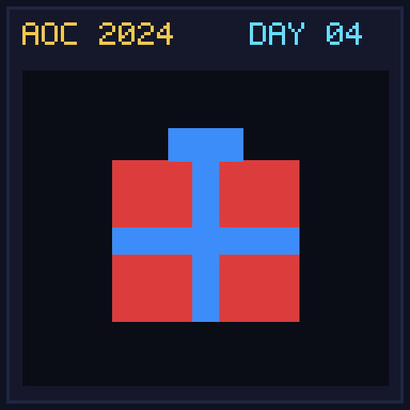

[< Day 03](../day03/README.md) | [AoC 2024](../README.md) | [Day 05 >](../day05/README.md)

[View Problem on Advent of Code](https://adventofcode.com/2024/day/4)

## Setup

Ceres Search - Day 4 of Advent of Code 2024.

## Solution

### Part 1

Solve Part 1 of the puzzle using idiomatic Kotlin.

### Part 2

Solve Part 2 of the puzzle.

## Performance

| Part | Runtime |
|:---:|:---:|
| Part 1 | 8.0ms |
| Part 2 | 4.0ms |
| **Total** | **12ms** |

