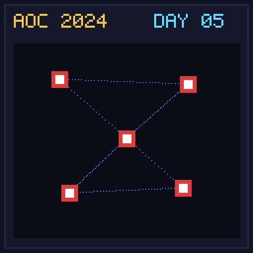

[< Day 04](../day04/README.md) | [AoC 2024](../README.md) | [Day 06 >](../day06/README.md)

[View Problem on Advent of Code](https://adventofcode.com/2024/day/5)

## Setup

Print Queue - Day 5 of Advent of Code 2024.

## Solution

### Part 1

Solve Part 1 of the puzzle using idiomatic Kotlin.

### Part 2

Solve Part 2 of the puzzle.

## Performance

| Part | Runtime |
|:---:|:---:|
| Part 1 | 23ms |
| Part 2 | 17ms |
| **Total** | **40ms** |

