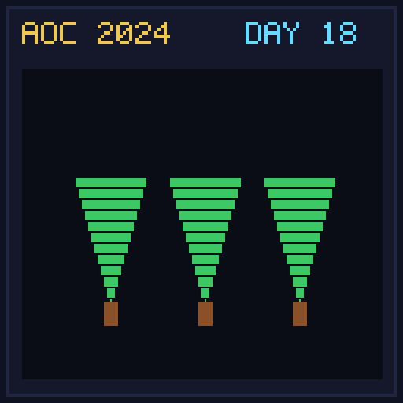

[< Day 17](../day17/README.md) | [AoC 2024](../README.md) | [Day 19 >](../day19/README.md)

[View Problem on Advent of Code](https://adventofcode.com/2024/day/18)

## Setup

RAM Run - Day 18 of Advent of Code 2024.

## Solution

### Part 1

Solve Part 1 of the puzzle using idiomatic Kotlin.

### Part 2

Solve Part 2 of the puzzle.

## Performance

| Part | Runtime |
|:---:|:---:|
| Part 1 | 7.0ms |
| Part 2 | 9.0ms |
| **Total** | **16ms** |

