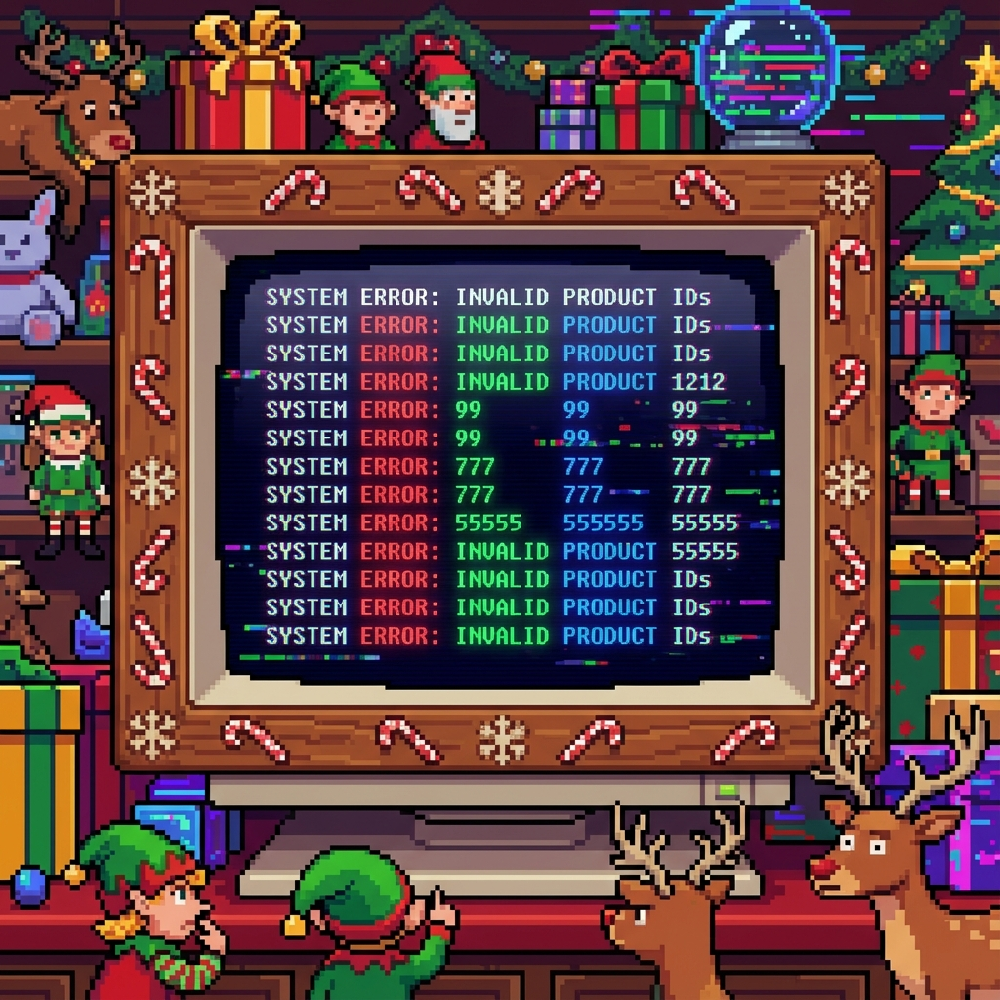
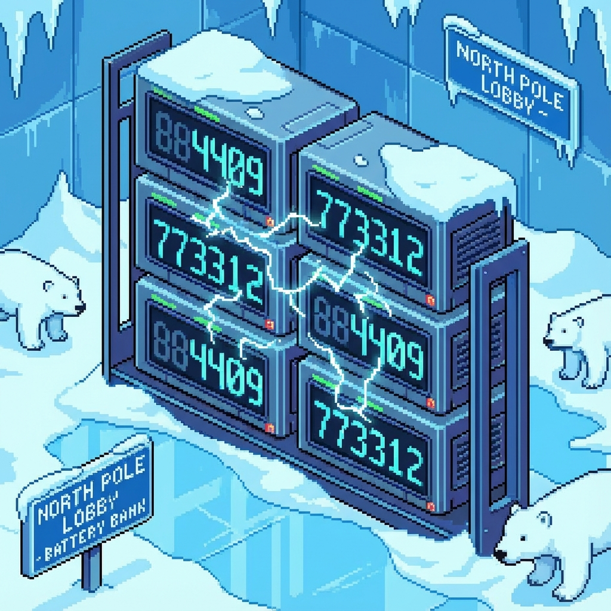
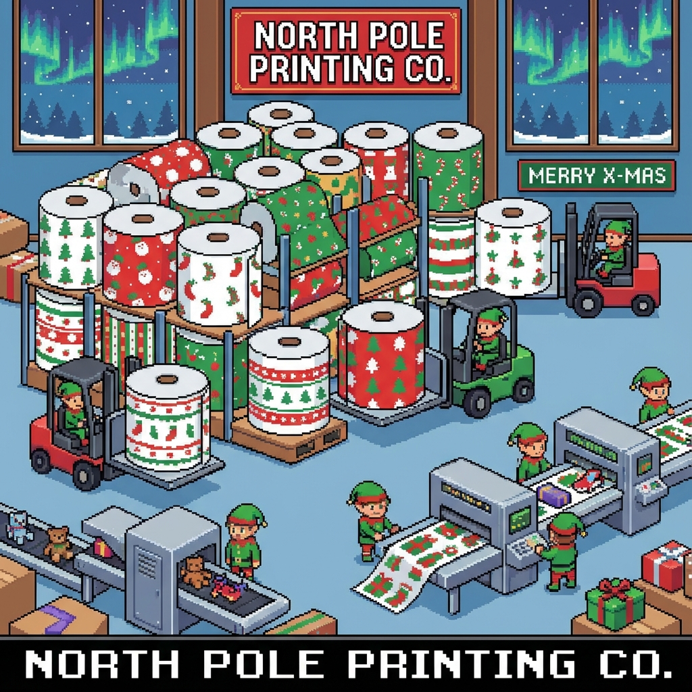
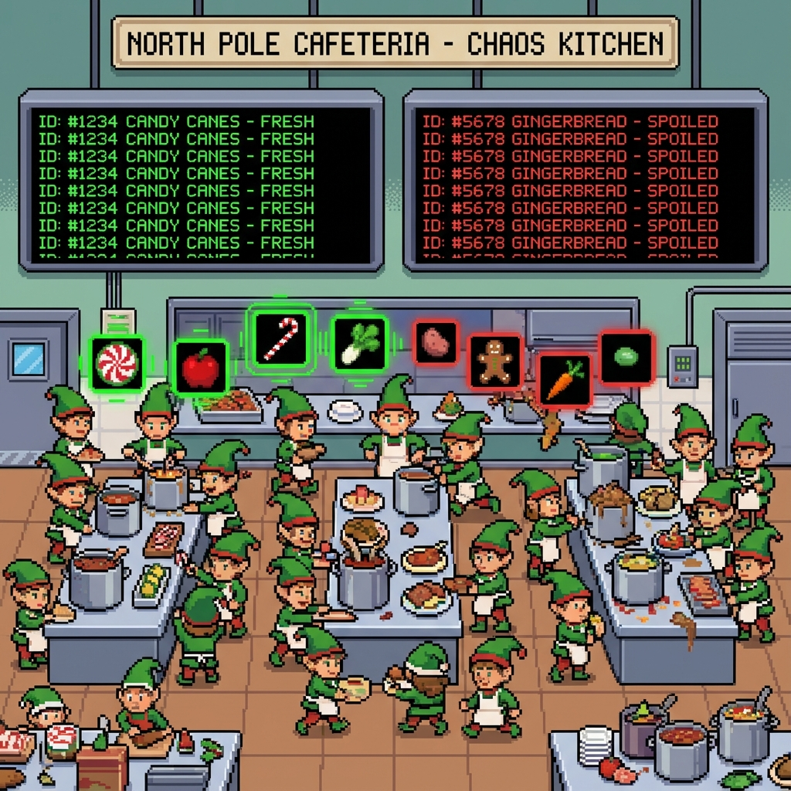
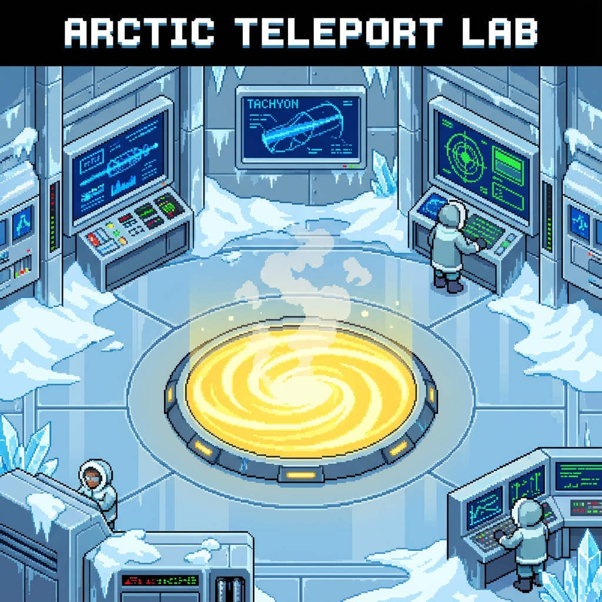
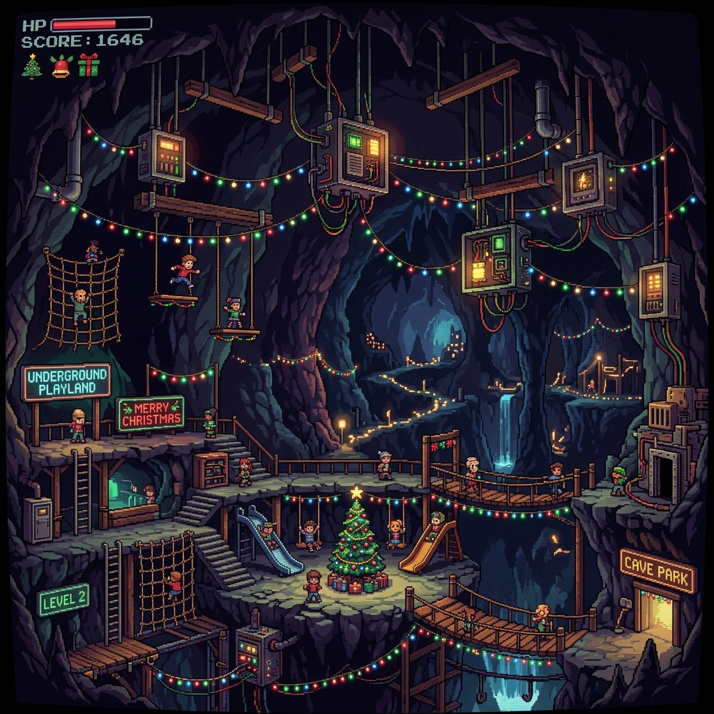
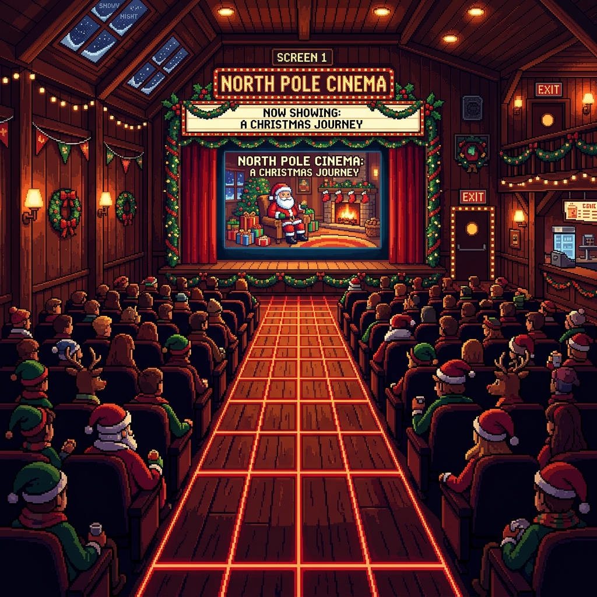
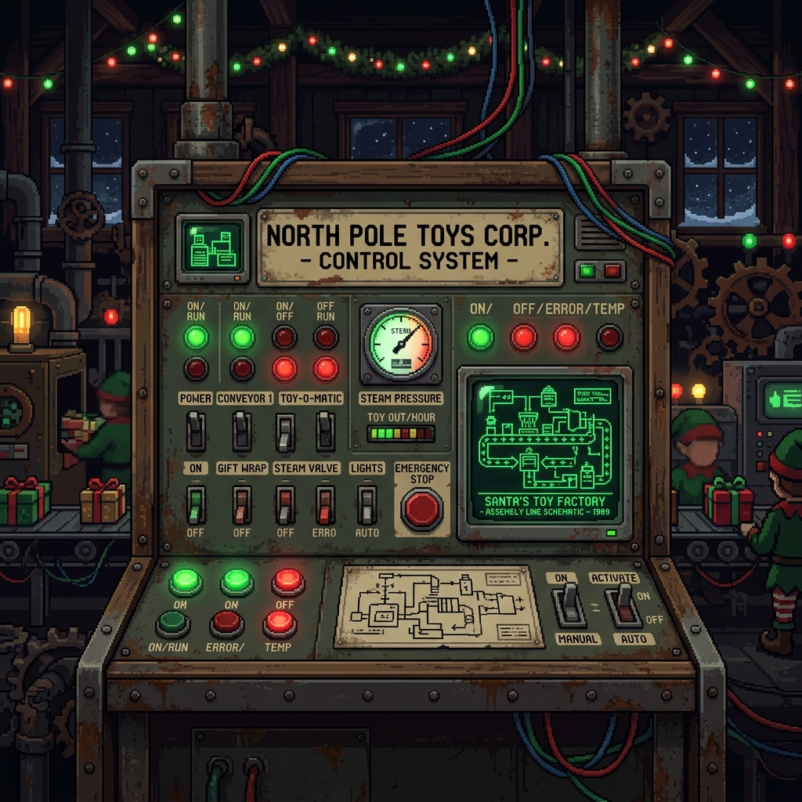
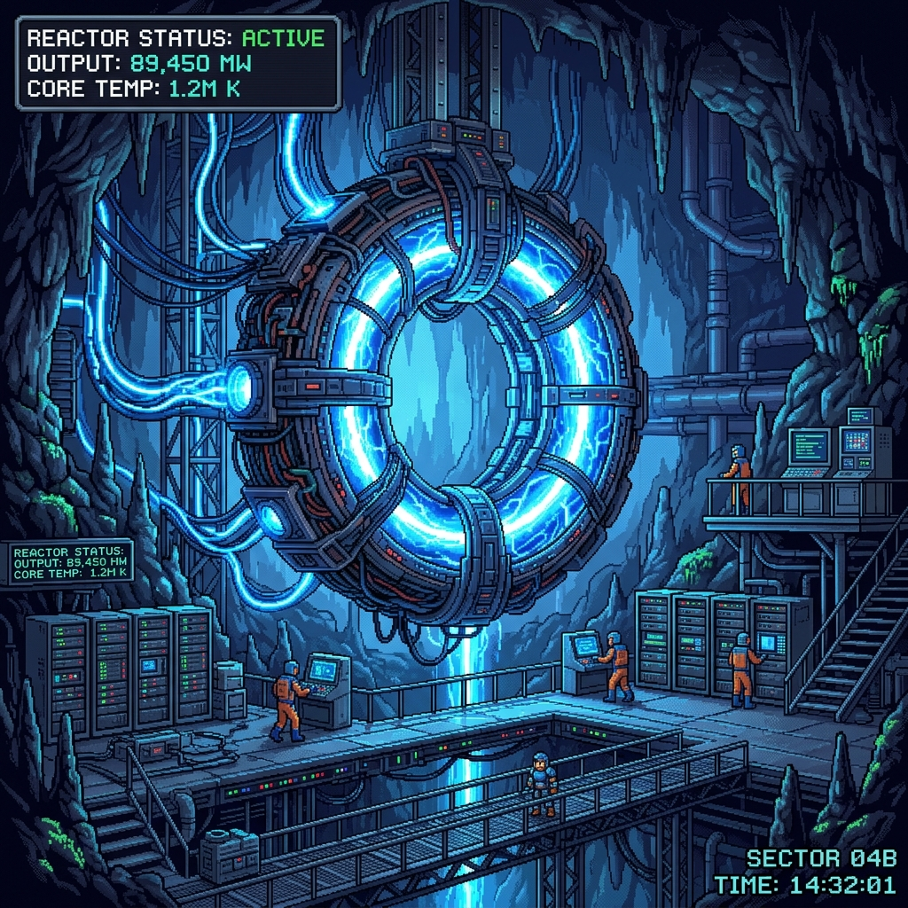
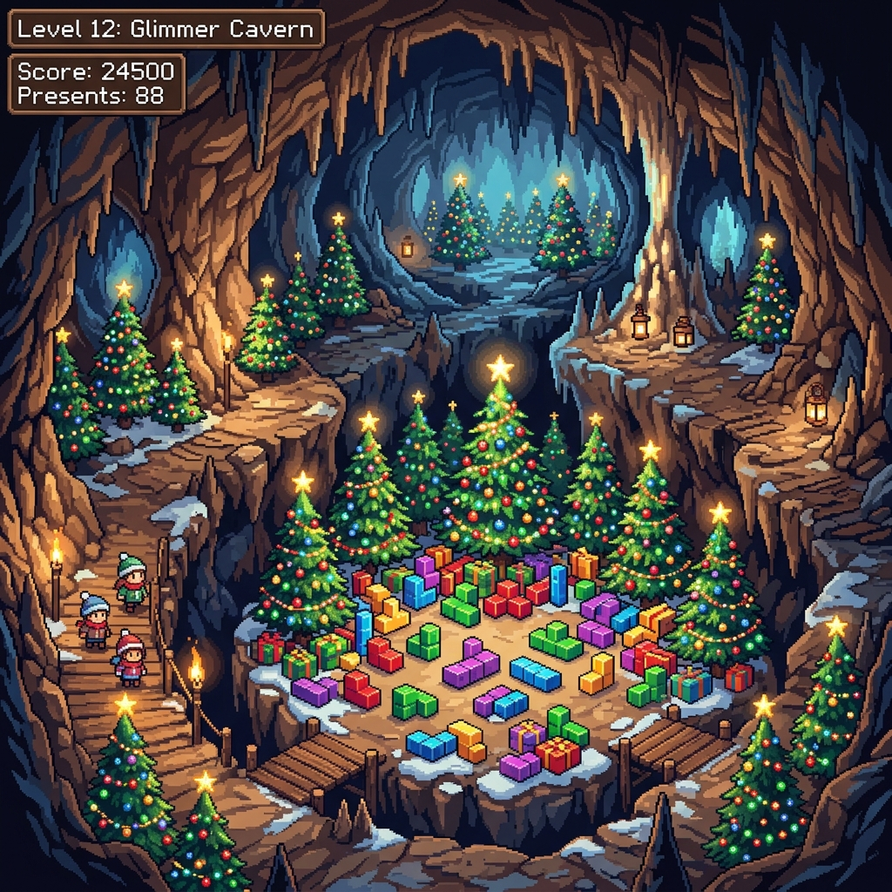

# Advent of Code 2025

Welcome to the solutions for Advent of Code 2025!
Here you can find the solutions, explanations, and art for each day.

## Solutions

| Day | Title | Part 1 | Part 2 | Total | Links |
|:---:|:---|:---:|:---:|:---:|:---|
| 01 | Day 1 | 2ms | 1ms | 3ms | [Readme](day01/README.md) / [Code](day01/Day01.kt) |
| 02 | Day 2 | 80ms | 325ms | 405ms | [Readme](day02/README.md) / [Code](day02/Day02.kt) |
| 03 | Day 3 | 0.0ms | 1ms | 1ms | [Readme](day03/README.md) / [Code](day03/Day03.kt) |
| 04 | Day 4 | 7ms | 9ms | 16ms | [Readme](day04/README.md) / [Code](day04/Day04.kt) |
| 05 | Day 5 | 5ms | 0.0ms | 5ms | [Readme](day05/README.md) / [Code](day05/Day05.kt) |
| 06 | Day 6 | 3ms | 4ms | 7ms | [Readme](day06/README.md) / [Code](day06/Day06.kt) |
| 07 | Day 7 | 4ms | 3ms | 7ms | [Readme](day07/README.md) / [Code](day07/Day07.kt) |
| 08 | Day 8 | 170ms | 157ms | 327ms | [Readme](day08/README.md) / [Code](day08/Day08.kt) |
| 09 | Day 9 | 7ms | 1308ms | 1315ms | [Readme](day09/README.md) / [Code](day09/Day09.kt) |
| 10 | Day 10 | 12ms | 886ms | 898ms | [Readme](day10/README.md) / [Code](day10/Day10.kt) |
| 11 | Day 11 | 2ms | 1ms | 3ms | [Readme](day11/README.md) / [Code](day11/Day11.kt) |
| 12 | Day 12 | 407ms | N/A | 407ms | [Readme](day12/README.md) / [Code](day12/Day12.kt) |

## Gallery

  
  
  
  
  
  
  
  
  
  
  
  

