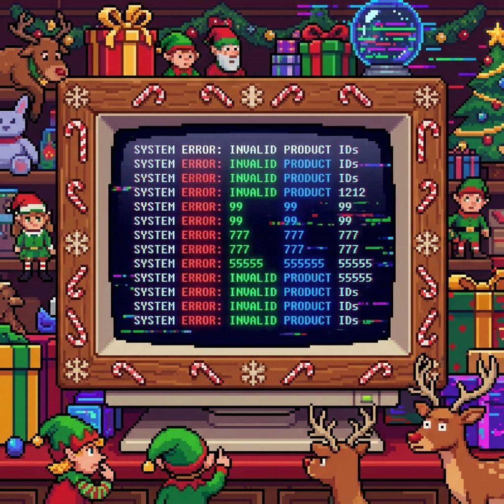

# Day 2: Gift Shop
[View Problem on Advent of Code](https://adventofcode.com/2025/day/2)

## Setup

A young Elf has accidentally added invalid product IDs to the North Pole gift shop database. You need to help identify them.
The "invalid" IDs are numbers that are formed by repeating patterns.

Part 1 defines an invalid ID as a number whose string representation is composed of a sequence of digits repeated exactly twice (e.g., `55`, `1212`, `38593859`).

## Solution

The solution iterates through the given ranges of IDs and checks each number.

### Part 1

For each number in the range:
1.  Convert it to a string.
2.  Check if its length is even.
3.  Split it into two halves.
4.  Check if the two halves are identical.

```kotlin
private fun findInvalidIds(range: String): List<Long> {
    val (first, last) = range.split("-").map(String::trim).map(String::toLong)

    return (first..last).mapNotNull { value ->
        val s = value.toString()
        val h = s.length / 2
        if (s.length.isEven() && s.take(h) == s.substring(h, s.length)) s.toLong() else null
    }
}
```

### Part 2

The second part extends the check to any repeating pattern, not just two halves. For example, `121212` (chunk size 2 repeated 3 times) would also be invalid in a broader sense (though the specific Problem Part 2 definition likely refines this to "any repetition").

The code checks for any chunk size that divides the string length evenly, and verifies if all chunks are identical.


