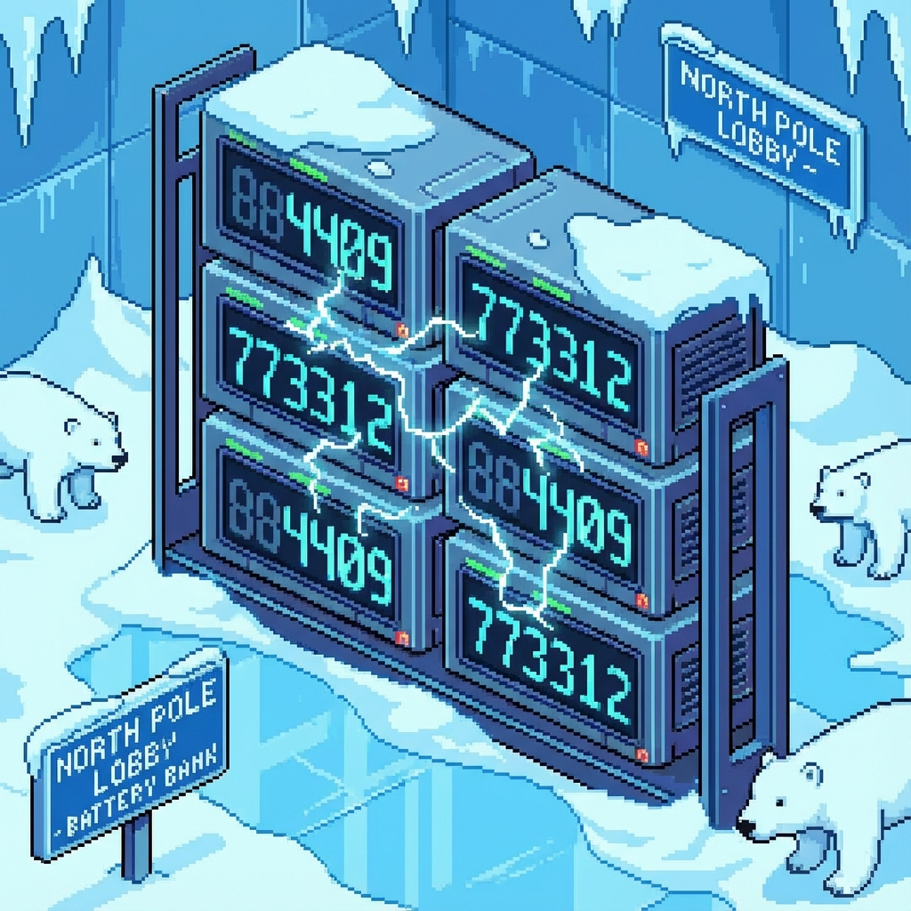

# Day 3: Lobby

## Setup

The main elevators in the North Pole lobby are offline. You can use an escalator, but it needs emergency power from batteries.
You have banks of batteries, each represented by a string of digits (joltage ratings).
To power the escalator, you need to select specific batteries from each bank to maximize the output.

In Part 1, you need to turn on exactly **two** batteries in each bank. The output joltage is the number formed by the two digits (e.g., selecting `9` and `8` gives `98`). The order of digits in the bank must be preserved.

## Solution

The goal is to find the maximum possible number formed by selecting digits while preserving their relative order.

### Part 1

To maximize a 2-digit number formed by digits $d_1 d_2$ (where $d_1$ appears before $d_2$ in the string):
1.  Find the largest digit available in the string (except the last position, as it needs a follower). Let this be $d_1$.
2.  Find the largest digit available in the string *after* the position of $d_1$. Let this be $d_2$.
3.  The result is $d_1 \times 10 + d_2$.

(Note: The code implementation might be slightly more robust or simplified, effectively scanning for the max first digit and then the max subsequent digit).

```kotlin
private fun maxJoltage(line: String): Int {
    val max = line.dropLast(1).max()
    val max2 = line.substringAfter(max).max()

    val a = ((max - '0') * 10) + (max2 - '0')
    return a
}
```

### Part 2

The second part extends this to forming a larger number, specifically picking **12** digits to form the maximum 12-digit number.
The logic generalizes: pick the largest valid digit for the current position that allows enough remaining digits to fill the rest of the requirement.


