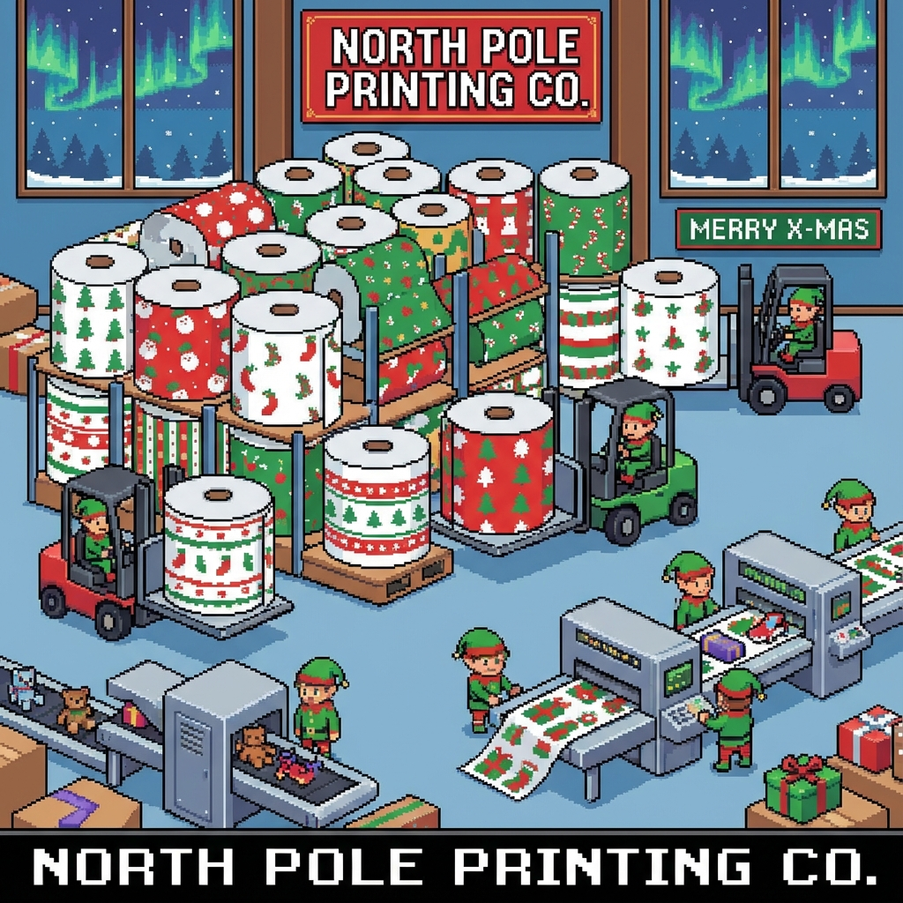

# Day 4: Printing Department

## Setup

The Printing Department is filled with large rolls of paper (`@`). You need to help the forklifts move them to clear a path.
A forklift can only access a roll of paper if it is not "blocked in".
Specifically, a roll is accessible if it has **fewer than 4** other rolls in its 8 adjacent positions.

## Solution

The solution involves analyzing the grid of paper rolls.

### Part 1

We iterate through every cell in the grid. If a cell contains a paper roll (`@`), we count its neighbors that are also paper rolls.
If the count of neighbor rolls is less than 4, the roll is accessible.
We return the total count of accessible rolls.

```kotlin
    return (0 until height).sumOf { y ->
        (0 until width).sumOf { x ->
            val location = Vector(x, y)
            if (getCell(location) == '@') {
                if (getNeighbors(location).count { it.second == '@' } < 4) 1 else 0
            } else {
                0
            }
        }
    }
```

### Part 2

The second part simulates the process of removing accessible rolls. When a roll is removed, it might make its neighbors accessible (by reducing their neighbor count).
This is efficiently implemented using a queue and an adjacency matrix (mapping rolls to their occupied neighbors).
1.  Initialize the queue with all initially accessible rolls.
2.  While the queue is not empty:
    *   Remove a roll (increment count).
    *   Update its neighbors: remove the current roll from their list of occupied neighbors.
    *   If a neighbor's occupied neighbor count drops to 3 (meaning it now has < 4 neighbors), add it to the queue.

This cascade effect allows us to count the total number of rolls that can eventually be accessed/removed.


