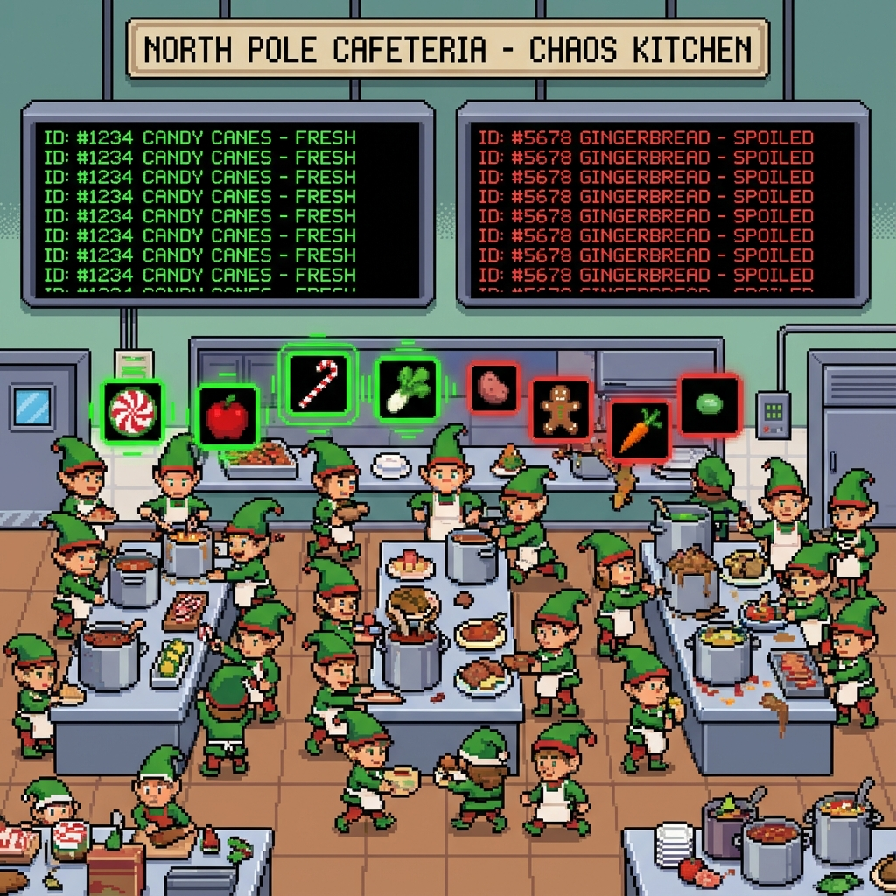

# Day 5: Cafeteria

## Setup

The Cafeteria's inventory system is confusing. It provides a list of "fresh" ingredient ID ranges (e.g., `3-5` means IDs 3, 4, and 5 are fresh) and a list of available ingredient IDs.
An ingredient is fresh if its ID falls into **any** of the fresh ranges.

## Solution

The solution revolves around checking overlap between a point (ID) and ranges, and later merging ranges.

### Part 1

For each available ingredient ID, we check if it exists in any of the "fresh" ranges.
We return the count of such fresh ingredients.

```kotlin
return ingredients.count { ingredient -> recipes.any { recipe -> ingredient in recipe } }
```

### Part 2

The second part (presumably) asks for the **total number** of fresh IDs available if we consider the union of all "fresh" ranges.
To do this efficiently (and handle overlaps):
1.  Sort the ranges by their start value.
2.  Iterate through the sorted ranges and merge overlapping or adjacent ranges.
    *   If the next range starts after the current range ends, the current range is complete.
    *   If the next range overlaps with the current range, extend the current range to cover both.
3.  Sum the lengths of the merged ranges.

## Art


