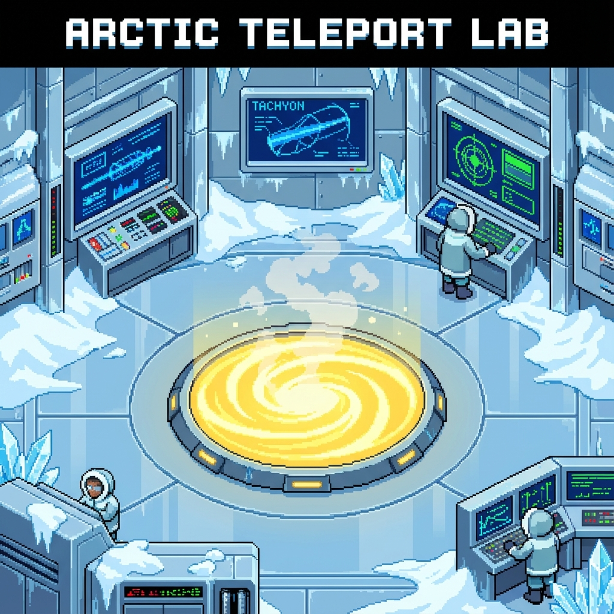

[< Day 06](../day06/README.md) | [AoC 2025 >](../README.md)

# Day 7: Laboratories

  

## Problem Description

[https://adventofcode.com/2025/day/7](https://adventofcode.com/2025/day/7)

## Solution Explanation

### Part 1: Tachyon Beams

The puzzle involves tracking a tachyon beam as it falls through a "manifold" filled with splitters (`^`).

I represented the grid sparsely: each row is converted into a list of indices where splitters are located. I then simulated the beam falling row by row.
- We maintain a list of active beam positions (column indices).
- For each row, we check each active beam.
- If a beam hits a splitter (`^`), it **splits** into two new beams: one to the left (`col - 1`) and one to the right (`col + 1`). I also increment a counter for every split that occurs.
- If it misses a splitter, it continues straight down.
- Duplicate beam positions are merged at each step.

The answer is the total number of splits encountered.

### Part 2: Many-Worlds Interpretation

Part 2 introduces a "quantum" twist: we need to count the total number of distinct timelines (paths) the particle could take. Since the paths branch at every splitter, the number of timelines can grow exponentially.

To solve this efficiently, I used **recursion with memoization**.

-   **State**: The current state is defined by `(beam_position, amount_of_rows_remaining)`.
-   **Transitions**:
    -   If the beam hits a splitter in the next row, the number of timelines is the sum of timelines from `(left_pos, next_row)` and `(right_pos, next_row)`.
    -   If the beam does not hit a splitter, it moves to `(current_pos, next_row)`.
-   **Base Cases**:
    -   If the beam goes out of bounds, that timeline is invalid (count = 0).
    -   If we reach the bottom of the manifold, we found one valid timeline (count = 1).

By catching the results of `solve(state)`, I avoided re-calculating the same sub-problems, allowing the solution to run very fast.

## Stats

| Part | Answer | Runtime |
|:---|:---|:---|
| Part 1 | 1581 | 5ms |
| Part 2 | 73007003089675 | 4ms |
